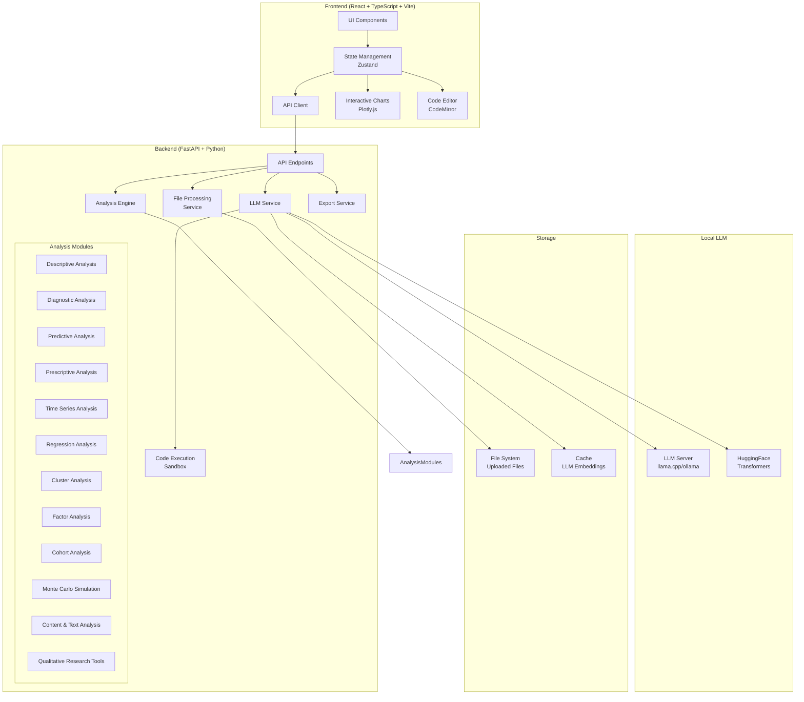

# BioViz: Data Visualization & Analysis with LLM Integration

## Architecture Diagram

## Component Descriptions

### Frontend Components

1. **UI Components**
   - File Upload Interface
   - Analysis Method Selector (Sidebar)
   - Visualization Canvas
   - Chart Configuration Controls
   - Data Table View
   - LLM Chat Panel
   - Theme Toggle (Dark/Light Mode)
   - Export Controls

2. **State Management (Zustand)**
   - Dataset State
   - UI State (selected analysis, active views)
   - LLM Chat History
   - Visualization Settings

3. **API Client**
   - HTTP Request Handlers
   - WebSocket Connection for Streaming Data
   - Error Handling

4. **Interactive Charts (Plotly.js)**
   - Configurable Chart Components
   - Event Handlers (zoom, pan, brush, hover)
   - Linked Views

5. **Code Editor (CodeMirror)**
   - Syntax Highlighting
   - Auto-completion
   - Code Execution Interface

### Backend Components

1. **API Endpoints**
   - File Upload API
   - Dataset Operations API
   - Analysis API
   - LLM Query API
   - Export API

2. **File Processing Service**
   - CSV/XLSX Parser
   - Schema Inference
   - Data Validation
   - Large File Chunking

3. **Analysis Engine**
   - Analysis Registry
   - Computation Orchestration
   - Result Formatting

4. **Analysis Modules**
   - Descriptive Statistics
   - Diagnostic Analysis
   - Predictive Modeling
   - Prescriptive Analysis
   - Time Series Analysis
   - Regression Analysis
   - Cluster Analysis
   - Factor Analysis
   - Cohort Analysis
   - Monte Carlo Simulation
   - Content & Text Analysis
   - Qualitative Research Tools

5. **LLM Service**
   - Prompt Engineering
   - Context Management
   - Response Parsing
   - Code Extraction
   - LLM Provider Abstraction

6. **Code Execution Sandbox**
   - Secure Code Validation
   - Execution Environment
   - Result Capture
   - Error Handling

7. **Export Service**
   - Chart Image Generation
   - SVG Processing
   - PowerPoint Slide Creation
   - Data Export

### Local LLM Integration

1. **LLM Server Options**
   - llama.cpp Server Interface
   - Ollama REST Client
   - HuggingFace Transformers Direct Integration

2. **Storage**
   - File System for Uploaded Datasets
   - Cache for LLM Embeddings and Results

## Data Flow

1. **File Upload Flow**
   - User uploads CSV/XLSX file
   - Backend validates and processes file
   - Schema information returned to frontend
   - Dataset loaded into memory or chunked if large

2. **Analysis Flow**
   - User selects analysis method
   - Frontend sends configuration parameters
   - Backend executes analysis
   - Results streamed back to frontend
   - Frontend renders visualizations

3. **LLM Query Flow**
   - User enters natural language query
   - Frontend sends query + chat history + dataset metadata
   - LLM Service processes request through local LLM
   - LLM generates explanation and executable code
   - Code Execution Sandbox runs the code
   - Results streamed back to frontend
   - Frontend displays explanation and visualization

4. **Export Flow**
   - User selects export option
   - Frontend requests export from backend
   - Backend generates export files
   - Files sent to frontend for download