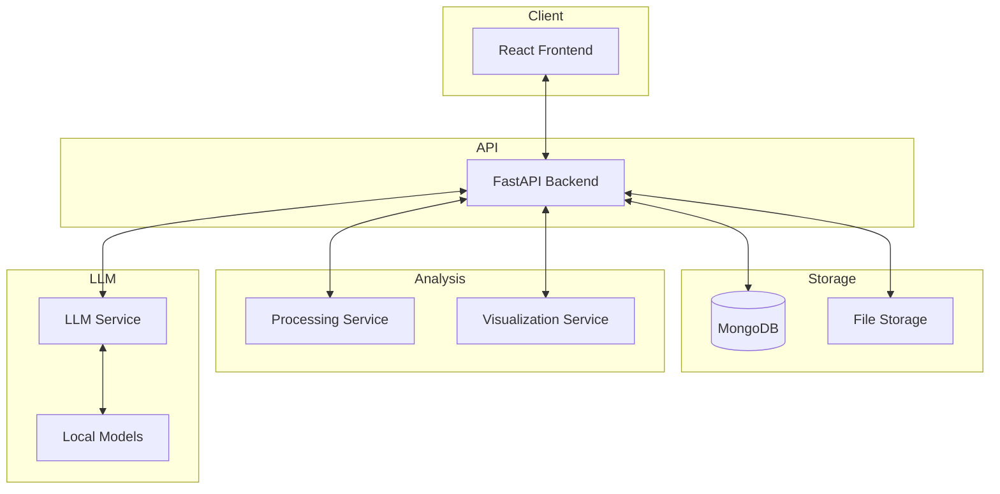

# Bioinformatics Data Visualization Platform

A full-stack application for bioinformatics data visualization with LLM integration.

## Architecture



## Key Components

### File Upload and Parsing System
- Support for various bioinformatics file formats (FASTA, FASTQ, VCF, GTF, BED, CSV, TSV)
- Automatic format detection and validation
- File metadata extraction and preview generation
- Secure storage with access control

### Analysis Methods
- Sequence alignment and comparison
- Clustering and classification
- Dimensionality reduction (PCA, t-SNE, UMAP)
- Differential expression analysis
- Phylogenetic analysis
- Variant calling and annotation
- Functional enrichment and pathway analysis
- Network analysis

### Interactive Visualization Layer
- Heatmaps for expression data
- Scatter plots for dimensional reduction
- Network graphs for interaction data
- Genome browsers for genomic data
- Phylogenetic trees
- Customizable visualization settings
- Real-time filtering and exploration

### LLM Integration
- Local model deployment using llama.cpp
- Domain-specific models for bioinformatics
- Analysis interpretation and explanation
- Automatic insight generation
- Suggestion of relevant analyses
- Query-based exploration of results

### Downloadable Assets Functionality
- Export visualizations in various formats (PNG, SVG, PDF)
- Generate reports with analysis results
- Share results via URLs
- Export processed data in standard formats

## Project Structure

```
bioinformatics-visualizer/
├── backend/                # FastAPI backend
│   ├── api/                # API routes and endpoints
│   │   └── routes/         # API route modules
│   ├── core/               # Core business logic
│   ├── db/                 # Database models and connection
│   ├── models/             # Machine learning models
│   ├── schemas/            # Pydantic schemas
│   ├── services/           # Service layer
│   ├── tests/              # Test suite
│   └── utils/              # Utility functions
├── frontend/               # React+Vite+TS frontend
│   ├── public/             # Static assets
│   └── src/                # Source code
│       ├── assets/         # Images, fonts, etc.
│       ├── components/     # Reusable UI components
│       ├── hooks/          # Custom React hooks
│       ├── pages/          # Page components
│       ├── services/       # API client services
│       ├── types/          # TypeScript type definitions
│       └── utils/          # Utility functions
├── docker/                 # Docker configuration
│   ├── backend.Dockerfile  # Backend container
│   ├── frontend.Dockerfile # Frontend container
│   └── llm.Dockerfile      # LLM service container
└── docs/                   # Documentation
```

## Features

### File Management
- Upload bioinformatics data files
- Browse and manage uploaded files
- File previews and metadata
- Delete and download files

### Analysis
- Create new analyses on uploaded files
- Configure analysis parameters
- View analysis results
- Export analysis results

### Visualization
- Interactive data visualization
- Customizable visualization settings
- Export visualizations
- Share visualizations

### LLM Assistant
- Query the LLM about bioinformatics data
- Get explanations for analysis results
- Receive suggestions for further analyses
- Explore data through natural language

## Technology Stack

### Backend
- Python 3.11+
- FastAPI
- Pandas, NumPy, SciPy
- scikit-learn, Biopython
- PyTorch, Transformers
- MongoDB

### Frontend
- React 18
- TypeScript
- Vite
- TailwindCSS
- React Query
- D3.js, Plotly.js

### Deployment
- Docker & Docker Compose
- NVIDIA GPU support for LLM inference

## Getting Started

1. Clone the repository
2. Run with Docker Compose:
   ```
   docker-compose up -d
   ```
3. Access the application:
   - Frontend: http://localhost:5173
   - Backend API: http://localhost:8000
   - API Documentation: http://localhost:8000/docs

## Development

### Backend
```bash
cd backend
poetry install
poetry run uvicorn main:app --reload
```

### Frontend
```bash
cd frontend
npm install
npm run dev
```

## Testing
```bash
# Backend tests
cd backend
poetry run pytest

# Frontend tests
cd frontend
npm test
```

## License
MIT